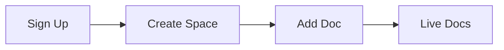

## Overview

Set up your Danny Chan Documentation space in under 5 minutes. This guide walks you through account creation, space setup, and publishing your first document. Danny Chan Documentation provides a complete platform for organizing project docs with MDX support, version control, and custom themes.

<Callout kind="tip">
  You need a GitHub account for authentication and repository integration.
</Callout>

## Prerequisites

Before starting, ensure you have:
- A modern browser like Chrome or Firefox
- A GitHub account (free tier works)
- Optional: Node.js 18+ for local development

## Create Your Account and Log In

Follow these steps to access Danny Chan Documentation.

<Steps>
  <Step title="Sign Up" icon="user-plus">
    Visit [dannychan-docs.com](https://dannychan-docs.com) and click **Sign Up**.

    Use your GitHub account for seamless OAuth login. This grants repository access for doc syncing.

  </Step>
  <Step title="Verify Email" icon="mail">
    Check your inbox for a verification email from Danny Chan Documentation.

    Click the link to activate your account. Verification enables full space creation features.
  </Step>
  <Step title="Log In" icon="log-in">
    Return to the dashboard and select **Log In**.

    Authorize GitHub permissions for read/write access to your repos.
  </Step>
</Steps>

## Create a New Documentation Space

Spaces organize your project docs. Each space links to a GitHub repo.

<Tabs>
  <Tab title="Web UI" icon="globe">
    From the dashboard, click **New Space**.

    Enter details:
    - Name: `my-project-docs`
    - GitHub Repo: Select or create `username/my-project-docs`
    - Brand Color: `#3B82F6`

    Click **Create**. Your space deploys automatically.
  </Tab>
  <Tab title="CLI" icon="terminal">
    Install the CLI tool first.

    <CodeGroup tabs="npm,yarn">
    ````bash
    npm install -g @dannychan/cli
    ````
    ````bash
    yarn global add @dannychan/cli
    ````
    </CodeGroup>

    Run setup:

    ````bash
    dannychan init my-project-docs
    cd my-project-docs
    git remote add origin https://github.com/username/my-project-docs.git
    git push -u origin main
    ````
  </Tab>
</Tabs>

## Add Your First Project Document

Publish a `quickstart.mdx` file to see live docs.

<Steps>
  <Step title="Create File" icon="file-plus">
    In your space editor or locally, add `docs/quickstart.mdx`.

    Use this starter content:

    ````mdx
    ---
    title: My First Doc
    description: Welcome to my project docs.
    ---

    ## Hello World

    Your docs are live!
    ````
  </Step>
  <Step title="Commit and Push" icon="git-commit">
    Commit changes:

    ````bash
    git add docs/quickstart.mdx
    git commit -m "Add quickstart guide"
    git push
    ````
  </Step>
  <Step title="View Live" icon="eye">
    Refresh your space URL. The doc appears instantly.

    Share `https://docs.dannychan.com/username/my-project-docs/quickstart`.
  </Step>
</Steps>



## Next Steps

Explore more features to enhance your docs.

<Columns cols={3}>
  <Card title="Customize Theme" icon="palette" href="/docs/themes">
    Adjust colors and layouts with your brand `#3B82F6`.
  </Card>
  <Card title="Add Components" icon="puzzle" href="/docs/components">
    Use Steps, Tabs, and Cards for rich content.
  </Card>
  <Card title="Version Control" icon="git-branch" href="/docs/versions">
    Manage releases with Git tags.
  </Card>
</Columns>

<Expandable title="Troubleshooting Common Issues" default-open="false">

- **Sync delays**: Wait 1-2 minutes for GitHub webhook processing.
- **Build errors**: Check repo for valid MDX syntax. Use `dannychan lint`.
- **Permissions**: Ensure GitHub app is installed on your repo.

</Expandable>

<Callout kind="success">
  Congratulations! Your Danny Chan Documentation space is ready. Start documenting your project today.
</Callout>